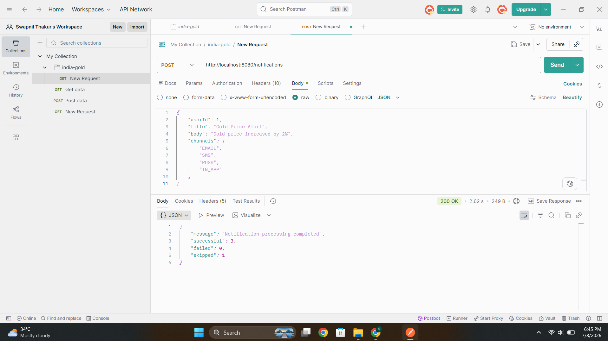
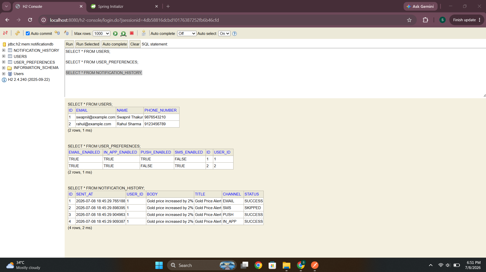
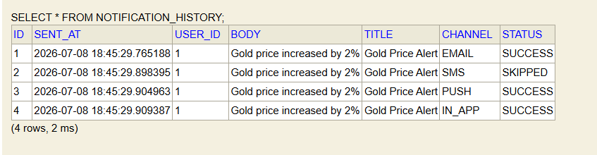
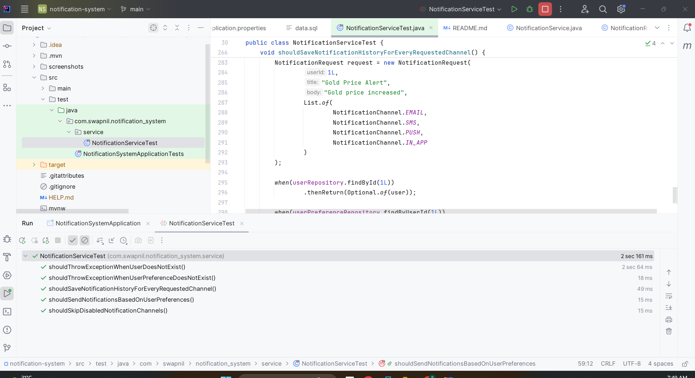
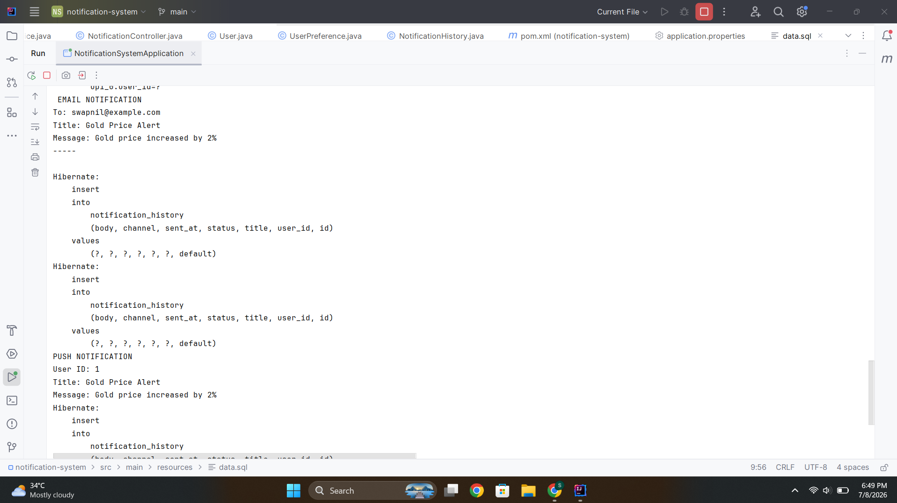

# Notification System

## Project Overview

The Notification System is a backend application built using Spring Boot that provides a unified REST API for sending notifications through multiple communication channels. Instead of exposing separate APIs for Email, SMS, Push, and In-App notifications, the application accepts a single notification request and routes it to the appropriate channels based on each user's notification preferences.

The project follows a layered architecture consisting of Controller, Service, Repository, Entity, and Sender components to keep the code modular, maintainable, and easy to extend. Every notification attempt is stored in the database, allowing the system to maintain a complete notification history for auditing and future analysis.

This project was developed as part of a backend engineering assignment with a focus on clean architecture, RESTful API design, preference-based notification routing, database persistence, and unit testing using JUnit 5 and Mockito.

---


## Features

- Unified REST API for sending notifications
- Multi-channel notification support
    - Email
    - SMS
    - Push Notification
    - In-App Notification
- Preference-based notification routing
- Notification delivery history tracking
- H2 in-memory database integration
- Spring Data JPA persistence
- Request validation using Jakarta Validation
- Layered project architecture
- Unit testing using JUnit 5 and Mockito
- REST API tested using Postman

---

## Tech Stack

| Technology | Purpose |
|------------|---------|
| Java 21 | Programming Language |
| Spring Boot 4 | Backend Framework |
| Spring Data JPA | Database Access |
| Hibernate | ORM Framework |
| H2 Database | In-Memory Database |
| Maven | Build Tool |
| Lombok | Boilerplate Code Reduction |
| JUnit 5 | Unit Testing |
| Mockito | Mocking Framework |
| Postman | API Testing |

---

## Project Structure

```
src
├── main
│   ├── controller
│   ├── dto
│   ├── entity
│   ├── enums
│   ├── repository
│   ├── sender
│   ├── service
│   └── NotificationSystemApplication
│
├── test
│   └── service
│       └── NotificationServiceTest
│
└── resources
    ├── application.properties
    └── data.sql
```

---
## Architecture

The project follows a layered Spring Boot architecture that separates responsibilities across the Controller, Service, Repository, and Entity layers. Notification delivery is delegated to dedicated sender implementations (Email, SMS, Push, and In-App), while user preferences determine which channels are allowed for each notification request.

<p align="center">
  
</p>

---

## Entity Relationship Diagram

The following Entity Relationship Diagram illustrates the database schema used by the Notification System. It represents the relationships between Users, User Preferences, and Notification History using Crow's Foot notation.

<p align="center">
  
</p>

---

## Database Design

The project contains three main database tables.

### Users

Stores user information.

- id
- name
- email
- phoneNumber

### User Preferences

Stores notification preferences for every user.

- emailEnabled
- smsEnabled
- pushEnabled
- inAppEnabled

Each user has exactly one preference record.

### Notification History

Stores every notification processed by the system.

- user
- channel
- status
- title
- body
- sentAt

This table acts as an audit log for all notification requests.

---

## API Documentation


### Send Notification

**Endpoint**

```
POST /notifications
```

### Sample Request

```json
{
    "userId": 1,
    "title": "Gold Price Alert",
    "body": "Gold price increased by 2%",
    "channels": [
        "EMAIL",
        "SMS",
        "PUSH",
        "IN_APP"
    ]
}
```

### Sample Response

```json
{
    "message": "Notification processing completed",
    "successful": 3,
    "failed": 0,
    "skipped": 1
}
```

---
## Testing the API with Postman

1. Start the Spring Boot application.

2. Open Postman.

3. Create a **POST** request:

```
http://localhost:8080/notifications
```

4. Set the header:

```
Content-Type: application/json
```

5. Copy the sample request body shown.

6. Click **Send**.

7. Verify the JSON response.

8. Open the H2 Console and execute:

```sql
SELECT * FROM NOTIFICATION_HISTORY;
```

to verify that notification records have been stored successfully.

---

## Notification Processing Flow

```
Client

      │

      ▼

NotificationController

      │

      ▼

NotificationService

      │

      ▼

User Validation

      │

      ▼

Preference Validation

      │

      ▼

Route Notifications

      │

      ▼

Save Notification History

      │

      ▼

Return API Response
```

---

## How to Run

### Clone the Repository

```bash
git clone https://github.com/Swapnil1Thakur/indiagold-notification-system.git
```

### Navigate to the Project

```bash
cd notification-system
```

### Build the Project

```bash
mvn clean install
```

### Run the Application

```bash
mvn spring-boot:run
```
Or run the project directly from your IDE by executing the `NotificationSystemApplication` class.


The application starts on:

```
http://localhost:8080
```

---

## H2 Database

H2 Console

```
http://localhost:8080/h2-console
```

Connection Details

| Property | Value |
|----------|-------|
| JDBC URL | jdbc:h2:mem:notificationdb |
| Username | sa |
| Password | *(leave blank)* |

---

## Testing

The project includes unit tests covering the core notification routing and validation logic.

### Test Scenarios

- Notification routing based on user preferences
- User not found validation
- User preference not found validation
- Disabled notification channels
- Notification history persistence

Frameworks Used

- JUnit 5
- Mockito

API endpoints were manually tested using Postman, while the core business logic was verified through JUnit 5 and Mockito unit tests.

---

## Future Improvements

- Integration with SMTP email providers
- SMS provider integration (Twilio)
- Push notification integration (Firebase Cloud Messaging)
- Kafka/RabbitMQ based asynchronous notification processing
- Retry mechanism for failed notifications
- Authentication and authorization using Spring Security
- Docker containerization
- PostgreSQL/MySQL production database support
- Notification scheduling
- Monitoring and logging using Prometheus and Grafana

---


## Screenshots

### API Testing

The notification endpoint was successfully tested using Postman.



---

### H2 Database

The application uses an H2 in-memory database to store users, user preferences, and notification history during development.



---

### Notification History

Each notification request is recorded with its delivery channel and status (SUCCESS / SKIPPED), providing a complete audit trail.



---

### Unit Testing Results

The notification service is covered with five JUnit 5 and Mockito unit tests that validate the core business logic, including notification routing, user validation, preference validation, disabled channel handling, and notification history persistence. All test cases pass successfully.

<p align="center">
  
</p>

---

### Application Console

Console logs showing notification processing and persistence during application execution.



---


## Author

**Swapnil Thakur**

Backend Developer | Java | Spring Boot | REST APIs | Spring Data JPA | Hibernate | SQL